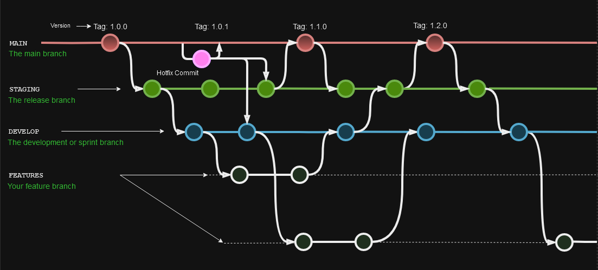
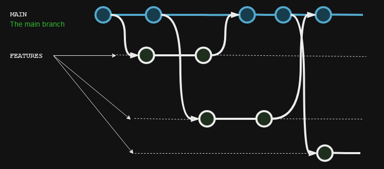
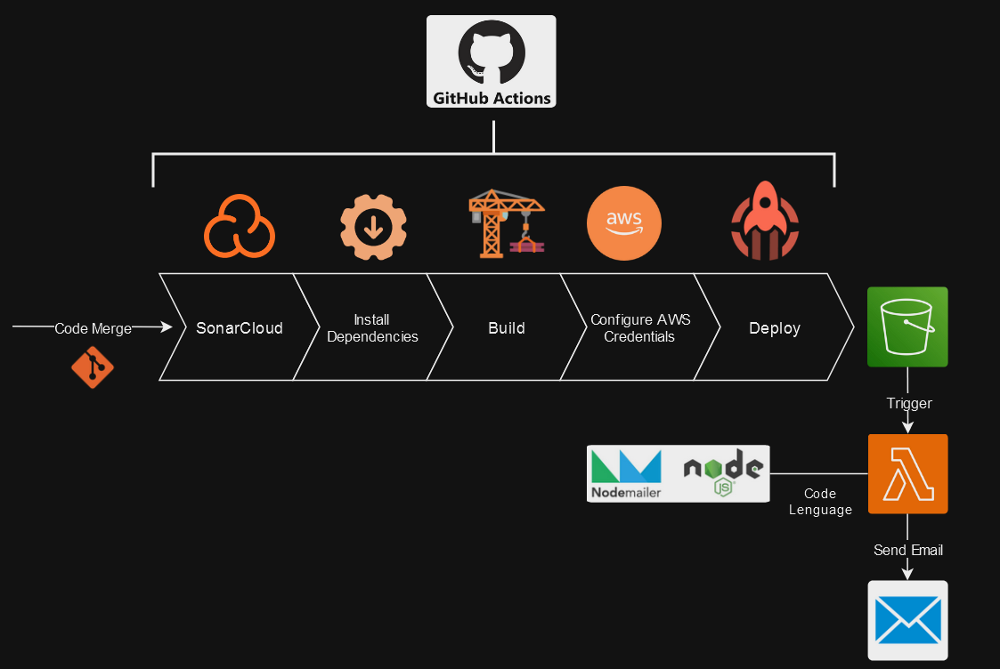

# 

  <h1>Taller DEV OPS</h1>
  <h2>Profesor: Federico Barceló</h2>
  <h3>Año: 2024</h3>
  <h3>Universidad ORT Uruguay</h3>
  <h4>Alumnos:</h4>
  
Maximiliano Lain (268678)

  
David de Araujo (207813)

## Índice
- [Problema](#problema)
- [Objetivos](#objetivos)
- [Propuesta](#propuesta)
- [Conclusiones](#conclusiones)

## Problema
En el corazón de la transformación digital de la empresa líder en retail, emergió un desafío inesperado, uno que pondría a prueba la resiliencia y adaptabilidad de su recién adoptada metodología de trabajo. La rápida transición hacia prácticas innovadoras y la adopción de nuevas tecnologías revelaron una brecha significativa en la comprensión y la comunicación entre los equipos de desarrollo y operaciones.

Este desafío se manifestó durante el lanzamiento de una nueva aplicación destinada a revolucionar la experiencia de compra de los clientes. A pesar de los esfuerzos meticulosos y la implementación de herramientas de vanguardia, el equipo se encontró frente a un problema recurrente: los despliegues de nuevas versiones de la aplicación resultaban en errores inesperados y caídas del sistema, afectando directamente la experiencia del usuario y la reputación de la empresa.

La raíz del problema no era técnica, sino cultural y organizativa. La tradicional separación entre los equipos de desarrollo, encargados de innovar y agregar nuevas características a la aplicación, y el equipo de operaciones, responsable de mantener la estabilidad y disponibilidad del sistema, había creado un ambiente donde la responsabilidad compartida y la comunicación efectiva eran deficientes.

El equipo de desarrollo, enfocado en la rapidez y en la entrega continua de nuevas funciones, a menudo subestimaba el impacto de sus cambios en la infraestructura y en la experiencia del usuario final. Por otro lado, el equipo de operaciones, priorizando la estabilidad sobre la innovación, se encontraba constantemente en una posición reactiva, lidiando con problemas sin tener una comprensión completa de las nuevas actualizaciones.

Este escenario evidenció un problema fundamental: la falta de una cultura de colaboración y entendimiento mutuo entre los equipos. La solución requería más que solo la adopción de herramientas y prácticas; necesitaba un cambio en la mentalidad y en la forma en que los equipos interactuaban entre sí.

Ante la creciente tensión y los desafíos que surgían de la desconexión entre los equipos de desarrollo y operaciones, la dirección ejecutiva de la compañía intervino, reconociendo la necesidad de abordar no solo los síntomas sino las causas fundamentales de estos problemas. Se hizo evidente que la solución requerirá más que ajustes superficiales en los procesos técnicos; siendo imperativo un cambio cultural profundo que alineará a todos los equipos bajo un conjunto común de objetivos y prácticas.

Por lo tanto, se le solicita al equipo de proyecto un plan de acción detallado que no solo aborde las ineficiencias operativas evidentes sino que también fomente un ambiente de colaboración, transparencia y aprendizaje continuo.

Este plan deberá incluir estrategias específicas para mejorar la comunicación y la colaboración entre los equipos de desarrollo y operaciones, identificar y eliminar barreras que impidan la eficacia de los flujos de trabajo integrados, establecer prácticas que promuevan una comprensión mutua de los desafíos y objetivos compartidos.

Se espera que, a través de esta iniciativa, la empresa no sólo superará los obstáculos actuales sino que también sentará las bases para una agilidad y resiliencia operativa a largo plazo, asegurando así su posición competitiva en el mercado.

## Objetivos

Nuestro principal objetivo es implementar una metodología DevOps para mejorar significativamente las áreas descritas en el problema. Esto implica un enfoque en la integración fluida de las diferentes fases del desarrollo del producto final, la automatización de procesos repetitivos y la reducción de errores humanos. A continuación, describimos en detalle nuestros objetivos específicos:

Primero, buscamos crear una colaboración más fluida y eficiente entre los equipos de desarrollo y operaciones. Esto se logrará mediante la adopción de prácticas DevOps que fomenten la comunicación constante y la responsabilidad compartida en todas las etapas del ciclo de vida del desarrollo.

En segundo lugar, nos proponemos automatizar la mayor cantidad posible de procesos manuales repetitivos. La automatización reducirá los errores humanos, acelerará los tiempos de despliegue y liberará tiempo para que los equipos se concentren en tareas de mayor valor.

Además, pretendemos establecer una infraestructura escalable y flexible. Esto significa que la infraestructura debe poder adaptarse fácilmente a los cambios en las necesidades del negocio y del producto, permitiendo un crecimiento rápido y eficiente sin necesidad de reestructuraciones significativas.

Otro objetivo clave es la implementación de instancias de control de calidad tanto a nivel de código como funcional. Esto asegurará que el producto final no solo cumpla con los estándares técnicos, sino que también proporcione una experiencia de usuario óptima y confiable.

En resumen, nuestros objetivos generales son:

- **Fomentar la colaboración y comunicación efectiva entre los equipos de desarrollo y operaciones.**
- **Automatizar procesos repetitivos para minimizar errores humanos y acelerar despliegues.**
- **Crear una infraestructura escalable y flexible que se adapte a las necesidades del negocio.**
- **Implementar controles de calidad rigurosos a nivel de código y funcional para asegurar la excelencia del producto final.**

## Propuesta
<!-- Descripción de la propuesta aquí -->
### Herramientas
- **Github**: para el versionado y manejo de ramas.
- **Fork**: manejo de commits y ramas.
- **Visual Studio Code**: Editor de código.
- **AWS**: infraestructura.
- **Docker**: generador de imágenes.
- **Sonarcloud**: análisis de código estático.
- **Draw.io**: diseño de diagramas.
- **Jira**: organización de tareas.
- **Postman**: comunicación con API.
- **Terraform**: infraestructura como código.
- **Node.js y Nodemailer**: envío de emails.

### Ambientes

#### Ambientes Front End:
- **Producción**
- **Staging**
- **Develop**

#### Ambientes Back End:

##### Shipping:
- **Producción**
- **Staging**
- **Develop**

##### Orders:
- **Producción**
- **Staging**
- **Develop**

##### Products:
- **Producción**
- **Staging**
- **Develop**

##### Payments:
- **Producción**
- **Staging**
- **Develop**

### Estrategias de Versionado

Creamos en GitHub una organización, en esta tenemos 6 repositorios:
- **DevOps**: simplemente apuntado para la entrega de los recursos e infraestructura.
- **Front End**: código front end del proyecto, en lenguaje React.
- **4 Repositorios de backend (uno por cada microservicio)**:
  - **Shipping**
  - **Orders**
  - **Products**
  - **Payments**

Para los repositorios de front end y back end, la estrategia de ramas utilizada fue Gitflow. Esta metodología va de la mano con la necesidad de mantener varios ambientes, permitiendo una rama fija para cada uno de ellos. Gitflow facilita la diferenciación clara entre las ramas de desarrollo y producción, lo que nos permite enviar cambios de forma segura y gestionar versiones y correcciones de errores sin afectar la estabilidad del producto en producción. Esta estructura nos proporciona libertad y flexibilidad, asegurando que las nuevas características y correcciones de errores se integren de manera ordenada y controlada.

  

Para el repositorio de DevOps, al no necesitar representar ambientes en vivo ni afectar directamente las funcionalidades de los clientes, usamos trunk-based development. Esta metodología nos permite realizar e integrar cambios rápidamente, facilitando una integración continua que es ideal para la entrega de infraestructura y recursos.

  

En ambos casos, se utilizó el código identificatorio de los tickets en Jira para nombrar cada branch feature, así tener un buen naming convention y un fácil trackeo de cambios hechos.

### CI-CD

Para nuestro proyecto, implementamos dos pipelines de CI-CD diferentes para el Front End y el Back End. Ambos pipelines están basados principalmente en GitHub Actions y análisis de código estático con SonarCloud.

#### Front End

El pipeline de CI-CD para el Front End sigue estos pasos:

1. **Análisis de Código Estático**: En la primera etapa, se realiza un análisis de código estático utilizando SonarCloud para garantizar la calidad y la seguridad del código.
2. **Instalación de Dependencias**: Se instalan las dependencias necesarias para los pasos posteriores del pipeline.
3. **Build de la Aplicación**: Se realiza el build de la aplicación React.
4. **Configuración de Credenciales**: Se configuran las credenciales de acceso a AWS para permitir el despliegue.
5. **Despliegue a AWS**: Se despliega el build de la aplicación a AWS, específicamente a un bucket de S3. El ambiente de despliegue (producción, staging o desarrollo) depende de la rama a la que se hizo el merge.
6. **Notificación de Despliegue**: En AWS, se ejecuta una función Lambda que escucha los cambios en el bucket de S3 y envía un correo electrónico al usuario para confirmar que el despliegue fue correcto.

  

#### Back End

El pipeline de CI-CD para el Back End sigue una estructura similar, con etapas específicas para cada microservicio. Cada microservicio tiene su propio repositorio y pipeline, asegurando una integración y despliegue independientes y controlados.

1. **Análisis de Código Estático**: Se realiza un análisis de código estático utilizando SonarCloud.
2. **Instalación de Dependencias**: Se instalan las dependencias necesarias para el proyecto.
3. **Build y Pruebas**: Se construyen los artefactos del proyecto y se ejecutan pruebas automatizadas.
4. **Configuración de Credenciales**: Se configuran las credenciales de acceso a AWS.
5. **Despliegue a AWS**: Se despliega el microservicio a la infraestructura de AWS correspondiente.
6. **Notificación de Despliegue**: Se implementan notificaciones para informar a los equipos sobre el estado del despliegue.

Ambos pipelines están diseñados para asegurar que cada cambio se integre y despliegue de manera segura y eficiente, minimizando los errores y asegurando una alta calidad en la entrega del producto.

### Microservicios

Implementamos cuatro microservicios, cada uno desarrollado y gestionado de forma independiente con su propio repositorio y su propia imagen de Docker. Al utilizar una arquitectura basada en microservicios, logramos encapsular las funcionalidades de cada servicio, permitiendo que operen de manera autónoma. Aunque los microservicios están interconectados, esta independencia significa que un fallo en uno de ellos no afectará críticamente la disponibilidad total del producto. Esta estrategia no solo mejora la resiliencia del sistema, sino que también facilita el mantenimiento y la escalabilidad, permitiendo actualizaciones y despliegues más ágiles y seguros.

### Análisis de Código Estático

Para el análisis de código, usamos SonarCloud, el cual ejecutamos como el primer paso de nuestro pipeline de CI-CD. Este análisis inicial nos permite verificar que el código cumpla con los estándares de calidad definidos y pase el quality gate que hemos configurado. Utilizamos el quality gate predeterminado de la plataforma. Es crucial destacar que si el análisis de calidad del código no es satisfactorio, todo el pipeline de CI-CD fallará. 

A continuación, presentamos el último reporte de análisis de código estático de los repositorios de Front End y Back End.

### Infraestructura

Nuestra infraestructura está centralizada en AWS, utilizando varios de sus servicios en la nube para asegurar la eficiencia y escalabilidad de nuestro proyecto.

#### Front End

Para el Front End, hemos implementado los siguientes recursos:

- **S3**: Tres buckets de S3, uno para cada ambiente (Producción, Staging, Desarrollo).
- **Serverless**: Funciones Lambda que escuchan los cambios en cada uno de los buckets de S3 para notificar al usuario una vez que se realiza un deploy.

#### Back End

Para el Back End, utilizamos:

- **ECS**: Amazon Elastic Container Service para la orquestación de contenedores Docker.
- **ALB**: (Pendiente especificar el servicio exacto utilizado)
- **Otro**: (Pendiente especificar el servicio exacto utilizado)

#### Automatización con Terraform

Utilizamos Terraform para automatizar la creación de todos los recursos de infraestructura mencionados anteriormente. Esta herramienta nos brinda una gran ayuda y facilidad para replicar la infraestructura, ya sea para este proyecto o para proyectos similares en el futuro. Terraform nos permite desplegar toda la infraestructura simplemente ejecutando el código, levantando en menos de un minuto todas las configuraciones y recursos necesarios en AWS, entre otros beneficios.

### Test

En la sección de test, utilizamos principalmente las herramientas de testeo que ofrece Postman para validar la funcionalidad y disponibilidad de las APIs de nuestros microservicios. Postman nos permite crear y ejecutar pruebas automáticas, asegurando que nuestros endpoints respondan correctamente y cumplan con las expectativas definidas.

Además, con Postman podemos agregar nuevos escenarios de prueba en el futuro, cubriendo así una mayor variedad de casos y asegurando la robustez de nuestras APIs a medida que el proyecto evoluciona. 

También estamos considerando la incorporación de otras herramientas y metodologías de prueba en diferentes instancias de la aplicación para garantizar una cobertura completa y exhaustiva.

## Conclusiones
<!-- Descripción de las conclusiones aquí -->
